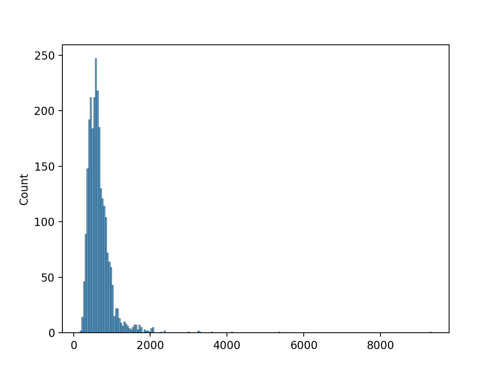

# **Introduction to patentpy**
#### **James Yu, Raoul R. Wadhwa, Hayley Beltz, Milind Y. Desai, Jacob G. Scott, Péter Érdi**
#### **30 May 2021**

## **Purpose**
_______________
Information about patents approved in the United States is publicly available. The United States Patent and Trademark Office (USPTO) provides digital bulk patent files on its website containing basic details including patent titles, application and issue dates, classification, and so on. Although files are available for patents issued during or after 1976, patents from different periods are accessible in different formats: patents issued between 1976 and 2001 (inclusive) are provided in TXT files; patents issued between 2002 and 2004 (inclusive) are provided in XML format; and patents issued during or after 2005 are provided in a distinct XML format. The `patentpy` python package accesses USPTO bulk data files and converts them to rectangular CSV format so that users do not have to deal with distinct formats and can work with patent data more easily.


## **Installation**
___________________
PyPI hosts the stable version of `patentpy` and GitHub hosts the development version. Each of the lines of code below install the respective version.
```bash
# stable version from PyPI
pip install patentpy

# development version from Github clone repository then run follow code from its parent directory
pip install git+https://github.com/JYProjs/patentpy
```


## **Data acquisition**
________________________
Acquiring patent data from the USPTO is straightforward with `patentpy`’s `get_bulk_patent_data` function. First, we load `patentpy` and the packages we’ll need for this vignette.
```python
import matplotlib.pyplot as plt
import seaborn as sns
import pandas as pd
from patentpy import get_bulk_patent_data
```

```python
>>> df = get_bulk_patent_data([1976]*2, [1,2])
>>> # Peek at patent data
>>> df.head()
           WKU     Title  App_Date  Issue_Date  Inventor  Assignee ICL_Class  \
2631  03932...  Magne...  19740610  19760113    Emory...       NaN  G11B ...   
2632  03932...  Super...  19721229  19760113    Shoic...  Olymp...  G11B ...   
2633  03932...  Sound...  19740930  19760113    Franz...  Compu...  G11B ...   
2634  03932...  Magne...  19740314  19760113    Nelso...  Inter...  G11B ...   
2635  03932...  Rever...  19740910  19760113    Paul ...  Infor...  G11B ...   

     References    Claims  
2631  27788...   I cla...  
2632  35509...   What ...  
2633  30080...   I cla...  
2634  30050...   What ...  
2635  28863...   I cla...  

[5 rows x 9 columns]
```

## **Sample use**
_________________
For the recently acquired set of patents, let’s say we are interested in how long it took for the patents to get issued once the application was submitted. We can calculate the difference between issue date (Issue_Date column) and application date (App_Date) column, then either obtain a numerical summary or visualize the results as a histogram. The code block below does both.


```python
# format `App_Date` and `Issue_Date` as datetimes
>>> df['App_Date'] = pd.to_datetime(df['App_Date'], format='%Y%m%d')
>>> df['Issue_Date'] = pd.to_datetime(df['Issue_Date'], format='%Y%m%d')
>>> sns.histplot(data = df, x=(df['Issue_Date'] - df['App_Date']).dt.days)
<AxesSubplot:ylabel='Count'>
>>> plt.show()
```


In addition to application and issue dates, the downloaded USPTO data contains multiple text columns. More information about these can be found at https://uspto.gov.

## **Available data for each patent**
_____________________________________
Text in boldface corresponds to column names in datasets returned by get_bulk_patent_data. Note that the following definitions for each column in the returned dataset are intuitive, not official, definitions. For official definitions, visit https://uspto.gov.

* WKU: unique identifier for each patent. This is not identical to the patent number, but is derived from it. The WKU generally has an additional leading zero or a checksum at the end.
* Title: patent title.
* App_Date: date the patent application was submitted.
* Issue_Date: date the patent was filed.
* Inventor: person(s) or organization(s) credited with inventing the patent.
* Assignee: person(s) or organization(s) with an ownership interest in the patent.
* ICL_Class: patent class based on the International Patent Classification (IPC) system or Locarno. For more information, visit https://www.wipo.int/classifications/ipc/en.
* References: set of patents cited by this patent.
* Claims: text field of claims regarding what should be protected by this patent.